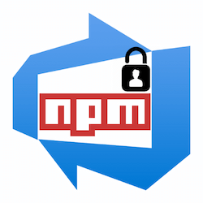

<p align="center"></p>

<h1 align="center">Azure DevOps npm auth-lite</h1>

<p align="center">
	<a href="https://github.com/johnnyreilly/ado-npm-auth-lite/actions/workflows/release.yml" target="_blank"></a>
	<a href="https://github.com/johnnyreilly/ado-npm-auth-lite/blob/main/.github/CODE_OF_CONDUCT.md" target="_blank"></a>
	<a href="https://github.com/johnnyreilly/ado-npm-auth-lite/blob/main/LICENSE.md" target="_blank"></a>
	<a href="http://npmjs.com/package/ado-npm-auth-lite"></a>
	
</p>

Simply set up user authentication to Azure DevOps npm feeds.

## Usage

To get `ado-npm-auth-lite` to create the necessary user `.npmrc` file, run the following command:

```shell
npx --yes ado-npm-auth-lite --config .npmrc
```

Should you encounter the following message when you try to `npm i`:

```shell
npm error code E401
npm error Unable to authenticate, your authentication token seems to be invalid.
npm error To correct this please try logging in again with:
npm error npm login
```

That means either:

- You have no user `.npmrc` file **OR**
- The token in your user `.npmrc` file is out of date

In either case, running `ado-npm-auth-lite` should resolve the issue.

## Integration with `package.json`

A great way to use `ado-npm-auth-lite` is as part of a `preinstall` script in your `package.json`:

```json
"scripts": {
  "preinstall": "npx --yes ado-npm-auth-lite"
},
```

With the above `preinstall` script in place, when the user performs `npm i` or similar, before attempting to install, the relevant user `.npmrc` file will be put in place so that installation for private feed packages just works™️. This is a **great** developer experience.

## Prerequisites

`ado-npm-auth-lite` requires that you are authenticated with Azure to acquire an Azure DevOps Personal Access Token. To authenticate, run `az login`. [If you need to install the Azure CLI, follow these instructions](https://learn.microsoft.com/en-us/cli/azure/install-azure-cli). It is not necessary to run `az login` if you are already authenticated with Azure.

You might be worried about `ado-npm-auth-lite` trying to create user `.npmrc` files when running CI builds. Happily this does not happen; it detects whether it is running in a CI environment and does **not** create a user `.npmrc` file in that case.

`ado-npm-auth-lite` requires the project `.npmrc` file exists in order that it can acquire the information to create the content of a user `.npmrc` file. There is an optional `config` parameter; if it is not supplied `ado-npm-auth-lite` will default to use the `.npmrc` in the current project directory. There will be information in your Azure DevOps Artifacts section for connecting to the npm feed around creating a project `.npmrc`. The file will look something like this:

```shell
registry=https://pkgs.dev.azure.com/johnnyreilly/_packaging/npmrc-script-organization/npm/registry/

always-auth=true
```

## Why Azure DevOps npm auth-lite?

Azure DevOps provides a mechanism for publishing npm packages for private use. This package sets up the necessary authentication to access those packages; particularly for non Windows users.

Consider the onboarding process for a Windows user for consuming an Azure Artifact npm feed:


Now consider the onboarding process for a non Windows user:


As we can see, there is a significant difference in the onboarding experience between operating systems. Windows users can use a tool named [`vsts-npm-auth`](https://www.npmjs.com/package/vsts-npm-auth) which automates onboarding. Non windows users have a longer road to follow. The instructions walk through manually creating an `.npmrc` file in a users home directory which contains information including a base 64 encoded Azure DevOps Personal Access Token with the Packaging read and write scopes. It is tedious to do.

`ado-npm-auth-lite` aims to automate the toil, and make the onboarding experience for non Windows users as simple as it is for Windows users.

There is an official package named [`ado-npm-auth`](https://github.com/microsoft/ado-npm-auth). However, [due to issues I experienced in using the `ado-npm-auth` package](https://github.com/microsoft/ado-npm-auth/issues/50), I found myself creating `ado-npm-auth-lite`. By the way, the "lite" in `ado-npm-auth-lite` doesn't represent anything in particular; I just couldn't think of another good name.

## Options

`-c` | `--config` (`string`): The location of the .npmrc file. Defaults to current directory

`-e` | `--email` (`string`): Allows users to supply an explicit email - if not supplied, will be inferred from git user.config

`-h` | `--help`: Show help

`-v` | `--version`: Show version

## Credits

> 💙 This package was templated with [`create-typescript-app`](https://github.com/JoshuaKGoldberg/create-typescript-app).
